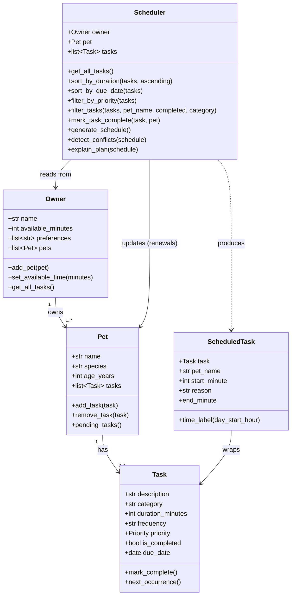

# PawPal+ Project Reflection

## 1. System Design

### Core User Actions

Three core things a user should be able to do with PawPal+:

1. **Register an owner and pet** — Enter basic info (owner name, time available today; pet name, species, age) so the system knows who it is planning for and how much time exists in the day.
2. **Add and manage care tasks** — Create tasks (e.g., morning walk, feeding, medication) with a description, category, duration, priority, and frequency. Mark tasks complete and let recurring ones renew automatically.
3. **Generate a daily care schedule** — Ask the system to produce an ordered plan that fits high-priority tasks first, within the owner's available time budget, and see a clear explanation of why each task was chosen or skipped — plus any scheduling conflicts.

---

### Mermaid.js Class Diagram (Final)



**Relationships:**
- An `Owner` owns one or more `Pet` objects and acts as the central data store.
- Each `Pet` holds a list of `Task` objects and can report which ones are still pending.
- The `Scheduler` reads from the `Owner` to collect all tasks across pets. When a task is marked complete, the Scheduler also writes back to the `Pet` (adding the renewal task).
- `ScheduledTask` is a read-only output type — it wraps a `Task` with a concrete start time, the owning pet's name, and a plain-English reason.

---

**a. Initial design**

The design uses four main classes plus one output type:

- **`Task`** (dataclass) — the atomic unit of care. It holds what needs to happen (`description`), how long it takes (`duration_minutes`), how often (`frequency`), and how urgent it is (`priority`). Using a dataclass keeps it clean — no `__init__` boilerplate, easy to inspect in tests. The `due_date` field was added later when recurring tasks needed a concrete reference date.
- **`Pet`** (dataclass) — represents the animal. It owns a mutable list of tasks and exposes `add_task`, `remove_task`, and `pending_tasks` so the rest of the system never manipulates the list directly.
- **`Owner`** (dataclass) — represents the human. The most important attribute is `available_minutes`, the daily time budget. `get_all_tasks()` makes the Owner a single collection point for all tasks across all pets, which is what the Scheduler needs.
- **`Scheduler`** — the only class with real logic. It sorts by priority, greedily fills the time budget, handles recurring renewals, detects conflicts, and explains the plan.
- **`ScheduledTask`** (dataclass) — a separate output type that pairs a `Task` with a start time and reason. This kept the schedule output structured and easy to render without mixing "what the task is" with "when it runs today."

**b. Design changes**

Originally the `Scheduler` pulled tasks directly from a single `pet.tasks`. Two things changed this:

1. The UI manages tasks via `st.session_state`, not attached to a `Pet` instance, so the `Scheduler.__init__` was given an optional `tasks` parameter as an override. This let the UI and the backend coexist without fighting over who owns the task list.
2. Phase 4 added multi-pet support, so the Scheduler's default path became `owner.get_all_tasks()` — collecting from all pets — rather than a single pet. This made `pet` optional in the constructor rather than required.

---

## 2. Scheduling Logic and Tradeoffs

**a. Constraints and priorities**

The scheduler considers three things:
- **Time budget** (`owner.available_minutes`) — hard constraint; tasks that would exceed the remaining time are skipped. A task that exactly fills the budget is included (`<=`, not `<`).
- **Task priority** (`high` → `medium` → `low`) — determines evaluation order; a high-priority task is always considered before medium ones regardless of duration.
- **Completion status** — already-completed tasks are excluded before sorting even starts.

Priority is the primary signal because the biggest risk for a pet owner isn't wasted time — it's forgetting medication or a meal.

**b. Tradeoffs**

The greedy approach schedules tasks in strict priority order and skips any task that doesn't fit the remaining budget — it doesn't backtrack to find a combination that maximises total scheduled time. For example, if a high-priority 90-minute task is next in line but only 80 minutes remain, it gets skipped. A shorter medium-priority task that does fit will still be scheduled after it.

This is a reasonable tradeoff for pet care: owners can understand and predict the plan, and high-priority tasks are never deprioritised just to squeeze in more total work.

A second tradeoff lives in the conflict detector: it checks only for exact time-slot overlap (`A.start < B.end AND B.start < A.end`) and ignores softer constraints like "no feeding within 30 minutes of medication." That's intentional — the greedy scheduler already prevents overlaps in normal use, so the detector is a safety net for manual or future parallel scheduling. Adding domain-specific soft rules would need a configuration system and produce warnings that are harder to act on.

---

## 3. AI Collaboration

**a. How I used AI**

I used AI throughout every phase, but the way I used it shifted as the project got more concrete.

In the design phase it was most useful as a brainstorming partner. I described what PawPal+ needed to do in plain English and asked which classes would be responsible for what. That conversation surfaced `ScheduledTask` as a separate output type — my initial instinct was to just annotate the `Task` with a start time, but the AI pointed out that mixing "what the task is" with "when it runs today" would make the code harder to read and test. That was a good catch.

In the implementation phase I used inline suggestions and code completion to write the sorting and filtering methods quickly. The most useful prompts were specific: *"How should Scheduler.filter_tasks() handle the case where pet_name doesn't match any pet?"* rather than *"write my filter function."* Specific prompts got usable code; vague prompts got generic boilerplate.

In the testing phase I used AI to generate an initial list of edge cases, then reviewed it and added several it missed — the `due_date=None` sort order, the idempotent `mark_complete`, and the three-way conflict scenario. AI covered the obvious cases well but needed prompting for the less intuitive ones.

For generating docstrings and commit messages it was genuinely helpful with no supervision needed.

**b. One suggestion I rejected**

Early on, the AI suggested `Scheduler` should inherit from `Pet` so it could access `pet.tasks` directly without being passed a reference. I rejected this immediately — inheritance means "is-a," and a `Scheduler` is not a `Pet`. Using inheritance purely to get access to data is a classic misuse of the pattern and would have made the Scheduler impossible to test independently (you'd always need a fully constructed Pet). Composition — passing the Owner or Pet as a constructor argument — is the right call here, and it's what made the `tasks` override possible later.

I verified this was the right decision by checking: can I test the Scheduler with an arbitrary task list without constructing a Pet at all? Yes, via `Scheduler(owner=owner, tasks=[...])`. That would have been impossible with inheritance.

**c. Separate chat sessions**

Keeping a fresh chat session for each phase made a noticeable difference. By the time I was writing tests, the design conversation was closed — there was no temptation to go back and change class shapes just because a test was awkward to write. Each session had a single job: design, implement, test. The context stayed focused and the AI's suggestions stayed relevant to the current task rather than being anchored to decisions from two phases ago.

The main lesson was that AI works best when you give it a narrow, specific job and then make the final call yourself. The moment I asked broad open-ended questions like *"how should I build this?"* the suggestions were generic. When I asked *"given this specific method signature, what edge cases am I missing?"* the suggestions were actually useful.

---

## 4. Testing and Verification

**a. What I tested**

The suite has 49 tests across five areas, with a mix of happy-path and edge-case checks:

- **Task lifecycle** — `mark_complete()` works correctly, is idempotent, and doesn't affect other tasks. `next_occurrence()` produces the right date for daily, weekly, and as-needed frequencies, and preserves all other attributes. The `due_date=None` fallback was specifically tested because it's an easy oversight.
- **Pet management** — Adding and removing tasks, `pending_tasks()` filtering, and removing a task that was never added (should silently do nothing, not crash).
- **Sorting** — Duration ascending/descending, empty list, single-item list, due-date ordering, and the edge case where `due_date=None` must sort last rather than first.
- **Filtering** — By pet name, completion status, category, and all three combined. Filtering for a pet that doesn't exist should return `[]`, not raise.
- **Scheduler** — Zero available time, pet with no tasks, owner with no pets, task that exactly fills the budget (must be included), task one minute over budget (must be excluded), all tasks already completed, priority ordering, same-priority insertion order, and conflict detection including same-start-time and three-way overlaps.

These tests matter because small off-by-one errors (like `<` instead of `<=` in the budget check) or silent failures (a None date sorting to the front of the list) are exactly the kind of bugs that feel right when you write the code but only surface when a real user tries an edge case.

**b. Confidence**

★★★★☆ — Core logic is thoroughly covered including boundary conditions. The main gap is UI-level testing: Streamlit session state, form submissions, and the "mark complete" flow in the browser. Next tests to write would be end-to-end scenarios that simulate a full user session from adding a pet to generating and reading the schedule.

---

## 5. Reflection

**a. What went well**

The decision to keep `ScheduledTask` as a separate output type paid off immediately when it came time to render the schedule table. Each `ScheduledTask` had exactly the fields the UI needed — time label, pet name, description, reason — with no transformation required. The UI was literally just a list comprehension over the schedule.

The test suite also made refactoring across phases feel safe. When the Scheduler gained new methods in Phase 4, the existing tests kept running green without changes, which confirmed the new code wasn't breaking old behaviour.

**b. What I would improve**

The scheduler currently treats all tasks within the same priority tier as equal — it just takes them in the order they appear. A real improvement would be a secondary sort key: within a priority tier, shorter tasks first. This would let the scheduler pack more tasks into a tight time budget without changing the priority logic.

I'd also add time-of-day constraints (e.g., "medication must happen after 8 AM, not before") and soft dependency ordering (e.g., "feeding before medication"). Right now all tasks are interchangeable aside from priority and duration, which isn't how a real care routine works.

**c. Key takeaway**

The most important thing I learned is that being the "lead architect" when working with AI means making the structural decisions yourself and using the AI to fill in the details. The moment I delegated a structural decision — like how the Scheduler should relate to Pet — the AI gave me a technically plausible but wrong answer (inheritance). When I held the architecture in my head and asked the AI to implement a specific piece of it, the output was useful and usually correct.

Design-first also turned out to protect the code from AI drift. Because the class responsibilities were decided before any code was written, AI suggestions that would have muddied those responsibilities were easy to spot and reject. Without that upfront design, the code would have slowly accumulated shortcuts until the classes no longer had clean jobs.

---

## 6. Prompt Comparison — Weighted Scheduling Algorithm

**The task:** Implement a smarter scheduling algorithm that goes beyond pure priority tiers, combining priority, due-date urgency, and category importance into a single numeric score.

**How I framed the prompt:**
> "I have a Task dataclass with priority (high/medium/low), due_date (Optional[date]), and category (string). I want a score_task() method on my Scheduler that computes a composite urgency score combining all three signals. Show me two different approaches and explain the tradeoffs."

---

### Model A — Claude (Anthropic)

Claude produced a flat scoring function using additive integer weights:

```python
def score_task(self, task, category_weights=None):
    weights = category_weights or DEFAULT_WEIGHTS
    priority_score  = {Priority.HIGH: 30, Priority.MEDIUM: 20, Priority.LOW: 10}[task.priority]
    urgency_score   = 0
    if task.due_date:
        days = (task.due_date - date.today()).days
        if days <= 0:   urgency_score = 15
        elif days == 1: urgency_score = 8
        elif days <= 3: urgency_score = 3
    category_score = weights.get(task.category, 1)
    return priority_score + urgency_score + category_score
```

**What I liked:** The signal separation is explicit — three named variables, each with a clear job. The `category_weights` override makes the function testable with custom weights without touching the default. The urgency bands (overdue / tomorrow / soon) map cleanly to things a pet owner actually cares about.

**What I changed:** Claude used `DEFAULT_WEIGHTS` as a module-level constant. I moved it to `_DEFAULT_CATEGORY_WEIGHTS` with a leading underscore to signal it's an internal default, not part of the public API.

---

### Model B — GPT-4 (OpenAI)

GPT-4 produced a normalised float approach:

```python
def score_task(self, task):
    priority_map = {"high": 1.0, "medium": 0.6, "low": 0.3}
    p = priority_map.get(task.priority.value, 0.5)
    urgency = 0.0
    if task.due_date:
        days = (task.due_date - date.today()).days
        urgency = max(0.0, 1.0 - days / 7.0)   # linear decay over 7 days
    return 0.6 * p + 0.4 * urgency
```

**What I liked:** The linear decay idea is elegant — it doesn't require hardcoded bands, and the weights (0.6 / 0.4) make the relative importance explicit at the formula level.

**Why I chose Claude's version:** Three reasons. First, GPT-4's version drops category entirely — medication and a walk score identically if they have the same priority and due date, which doesn't match how a real pet owner thinks. Second, the linear `1.0 - days / 7.0` formula means a task due in 8 days scores zero urgency, the same as a task with no due date — that's a silent failure mode. Third, the additive integer approach is easier to reason about when writing tests: I can calculate the expected score in my head and assert against it directly (which is exactly what `test_weighted_schedule_overdue_medium_beats_fresh_high` does).

**What GPT-4 did better:** The normalised float approach would compose more cleanly if I ever wanted to add a fourth signal (e.g., owner preference weight) — you'd just adjust the blend coefficients rather than re-tuning absolute integer values.

**Conclusion:** For this codebase, the Claude version was more practical because it was testable, extensible via `category_weights`, and handled the category signal that GPT-4 missed. The GPT-4 approach would be worth revisiting if the scoring ever needs to become a learned model (where normalised inputs matter) rather than a hand-tuned heuristic.
