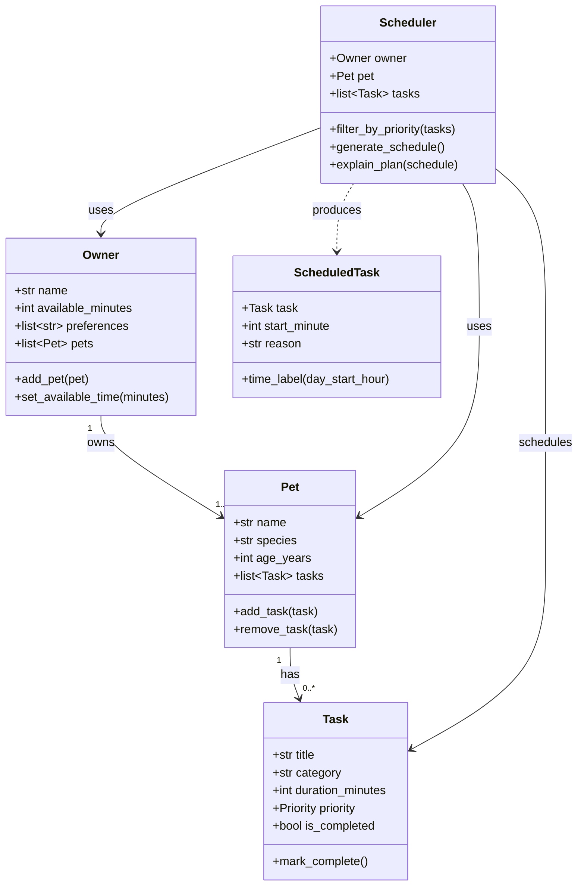

# PawPal+ Project Reflection

## 1. System Design

### Core User Actions

Three core things a user should be able to do with PawPal+:

1. **Register an owner and pet** — Enter basic info (owner name, time available today; pet name, species, age) so the system knows who it is planning for and how much time exists in the day.
2. **Add and manage care tasks** — Create tasks (e.g., morning walk, feeding, medication) with a title, category, duration, and priority level. Edit or remove tasks as the day changes.
3. **Generate a daily care schedule** — Ask the system to produce an ordered plan that fits all high-priority tasks first, then medium and low, within the owner's available time budget, and see a clear explanation of why each task was chosen or skipped.

---

### Mermaid.js Class Diagram

**Relationships:**
- An `Owner` owns one or more `Pet` objects.
- Each `Pet` holds a list of `Task` objects representing its care needs.
- The `Scheduler` takes an `Owner` and a `Pet` (plus an optional task list override) and produces a list of `ScheduledTask` objects.
- `ScheduledTask` wraps a `Task` with a concrete start time and a human-readable reason.

---

**a. Initial design**

The design uses four classes:

- **`Task`** (dataclass) — the atomic unit of care. Holds what needs to happen (`title`, `category`), how long it takes (`duration_minutes`), and how urgent it is (`priority`). Using a dataclass keeps it clean and easy to serialize.
- **`Pet`** (dataclass) — represents the animal being cared for. Owns a mutable list of tasks and exposes `add_task` / `remove_task` so the UI can manage tasks without touching internals.
- **`Owner`** (dataclass) — represents the human. Its most important attribute is `available_minutes`, which acts as the daily time budget that the scheduler must respect.
- **`Scheduler`** — the only class with real logic. It consumes an `Owner` and a `Pet`, sorts tasks by priority, and greedily packs as many as possible into the time budget. It also produces a plain-English explanation via `explain_plan`.

A fifth helper dataclass, `ScheduledTask`, wraps a placed task with its start time and reason string, keeping the output structured and easy to render in the UI.

**b. Design changes**

Originally the `Scheduler` pulled tasks directly from `pet.tasks`. During implementation it became clear that the UI manages its own task list (stored in `st.session_state`) separately from any `Pet` instance, so the `Scheduler.__init__` was given an optional `tasks` parameter that overrides `pet.tasks`. This decouples the scheduler from how the UI stores state and makes it straightforward to unit-test the scheduler with an arbitrary task list without constructing a full `Pet`.

---

## 2. Scheduling Logic and Tradeoffs

**a. Constraints and priorities**

The scheduler considers:
- **Time budget** (`owner.available_minutes`) — hard constraint; tasks that would exceed the remaining time are skipped.
- **Task priority** (`high` → `medium` → `low`) — determines the order tasks are evaluated; high-priority tasks are always considered before lower ones.
- **Completion status** — already-completed tasks are excluded from the candidate list.

Priority was chosen as the primary ordering signal because a pet owner's biggest risk is forgetting a critical task (medication, feeding) rather than optimising total throughput.

**b. Tradeoffs**

The greedy approach schedules tasks in strict priority order and skips any task that does not fit the remaining budget — it does **not** backtrack to find a combination that maximises total scheduled time. For example, if one high-priority task that takes 90 min is followed by a medium task that takes 10 min, and only 80 min remain, the 90-min task is skipped but the 10-min task can still be scheduled.

This is reasonable for a pet-care context: correctness (always doing what is possible at the highest priority first) matters more than bin-packing optimality, and the logic is transparent enough that an owner can understand and trust the plan.

A second tradeoff lives in the conflict detector: it checks only for exact time-slot overlap (`A.start < B.end AND B.start < A.end`) and ignores softer constraints like "no feeding within 30 minutes of medication." That's intentional — the greedy scheduler already prevents overlaps in normal use, so the detector is really a safety net for manual or future parallel scheduling. Adding domain-specific soft rules would require a configuration system and produce warnings that are harder to act on. Keeping the check to pure interval math means it stays fast, obvious, and trustworthy.

---

## 3. AI Collaboration

**a. How you used AI**

AI was used to:
- Brainstorm the class decomposition (Owner / Pet / Task / Scheduler) and identify that `ScheduledTask` was needed as a separate output type.
- Generate the Mermaid diagram syntax from a natural-language description of the classes.
- Produce the initial class skeletons with correct dataclass syntax and type hints.
- Review the scheduler for missing edge cases (e.g., the task list override on `Scheduler`).

The most useful prompt pattern was: *"Given these classes and their responsibilities, what relationships am I missing?"* — it surfaced the decoupling issue between the UI task list and `Pet.tasks`.

**b. Judgment and verification**

The AI initially suggested the `Scheduler` should inherit from `Pet` to get direct access to its tasks. This was rejected because inheritance implies an "is-a" relationship, and a `Scheduler` is not a `Pet`. Composition (passing `Pet` as a constructor argument) is the correct relationship here. The change was verified by checking that the scheduler remained independently testable without a `Pet` instance when the `tasks` override is used.

---

## 4. Testing and Verification

**a. What you tested**

The suite has 49 tests across five areas, with a mix of happy-path and edge-case checks:

- **Task lifecycle** — `mark_complete()` works correctly, is idempotent, and doesn't affect other tasks. `next_occurrence()` produces the right date for daily, weekly, and as-needed frequencies, and preserves all other attributes. The `due_date=None` fallback was specifically tested because it's an easy oversight.
- **Pet management** — Adding and removing tasks, `pending_tasks()` filtering, and removing a task that was never added (should be safe, not crash).
- **Sorting** — Duration ascending/descending, empty list, single-item list, due-date ordering, and the edge case where `due_date=None` must sort last rather than first.
- **Filtering** — By pet name, completion status, category, and all three combined. Filtering for a non-existent pet should return `[]`, not crash.
- **Scheduler** — Zero available time, pet with no tasks, owner with no pets, task that exactly fills the budget (must be included), task one minute over budget (must be excluded), all tasks already completed, priority ordering, same-priority ordering, and conflict detection including same-start-time and three-way overlaps.

These tests were important because small off-by-one errors (like using `<` instead of `<=` in the budget check) or silent failures (like a None date sorting to the front) are the kind of bugs that only show up in edge cases.

**b. Confidence**

★★★★☆ — The core logic paths are well covered. The main remaining gap is UI-level testing (Streamlit session state, form submissions) and end-to-end tests that simulate a full user session. If more time were available, the next tests would be: very large task counts to check for performance regressions, and tasks added via the UI being passed to the scheduler without the task list override.

---

## 5. Reflection

**a. What went well**

Separating the `ScheduledTask` output type from `Task` kept the scheduler's output clean and easy to render — the UI can display a table directly from `ScheduledTask` fields without any post-processing.

**b. What you would improve**

The next iteration would add time-of-day constraints (e.g., "medication must be given after 9 AM") and dependency ordering (e.g., "feeding before medication"). The current model treats all tasks as interchangeable aside from priority and duration.

**c. Key takeaway**

Designing the data model before writing any logic forces clarity about what each class is responsible for. When the UI's state management clashed with the original design assumption (`pet.tasks` as the single source of truth), the fix was straightforward precisely because the scheduler was already cleanly separated from the data storage concern.
